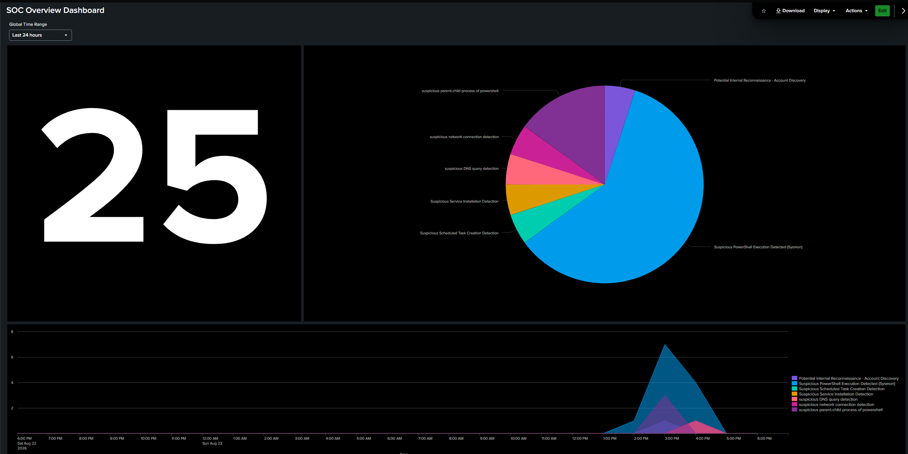
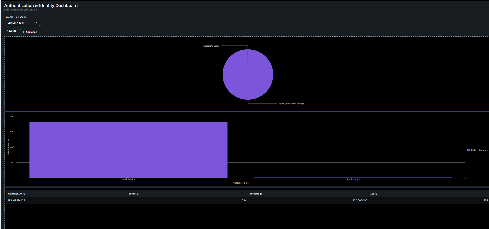
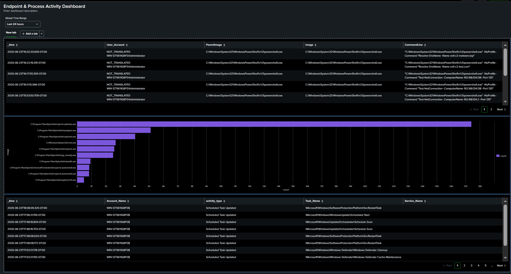

# 🛡️ Enterprise SOC & Detection Engineering Lab (Splunk SIEM)

A production-grade Security Operations Center (SOC) and Detection Engineering home lab built to simulate real-world cyber attacks, ingest endpoint telemetry into **Splunk Enterprise**, develop **MITRE ATT&CK-aligned detections**, and execute incident triage workflows.

---

## 🏗️ Architecture & Telemetry Pipeline

* **Target Host:** Windows Server 2022 / Windows 11 Enterprise
  * Log Sources: Windows Security Logs, System Logs, Application Logs
  * Advanced Endpoint Telemetry: **Microsoft Sysmon v15.0** (Deep Process, Network, DNS, and Task tracking)
  * Forwarder: Splunk Universal Forwarder (SUF) streaming to Port 9997
* **SIEM Platform:** Splunk Enterprise (Search Head & Indexer)
* **Attack Platform:** Kali Linux VM (Automated Brute Force, Malicious PowerShell execution, and Persistence simulation)


***STRUCTURE***
[ Kali Linux (Attacker) ] ──(Network/RDP/Attacks)──> [ Windows Endpoint (Target) ]
│
(Sysmon & Security Logs)
│
[ Universal Forwarder ]
│
(Port 9997 Stream)
▼
[ Splunk SIEM Enterprise ]
│
┌─────────────────┴─────────────────┐
▼                                   ▼
[ MITRE Detection Rules ]           [ SOC SOC Dashboards ]


***MITRE ATT&CK Detection Matrix (9 Rules)***
| MITRE Tactic | MITRE ID | Detection Rule Name | Telemetry Source | Detection File |
| :--- | :--- | :--- | :--- | :--- |
| **Credential Access** | `T1110.001` | Windows Brute Force Detection | Windows Security (`4625`) | [`brute_force_detection.spl`](detections/authentication/brute_force_detection.spl) |
| **Credential Access** | `T1110` / `T1078` | Potential Account Compromise (Brute Force Followed by Success) | Windows Security (`4625`, `4624`) | [`brute_force_followed_by_success.spl`](detections/authentication/brute_force_followed_by_success.spl) |
| **Execution** | `T1059.001` | Suspicious PowerShell Execution Detected (Sysmon) | Sysmon (`1`) | [`suspicious_powershell.spl`](detections/execution/suspicious_powershell.spl) |
| **Execution** | `T1059.001` / `T1566` | Suspicious Parent-Child Process Spawning PowerShell | Sysmon (`1`) | [`suspicious_powershell_parent.spl`](detections/execution/suspicious_powershell_parent.spl) |
| **Persistence** | `T1053.005` | Suspicious Scheduled Task Creation Detection | Windows Security (`4698`, `4702`) | [`scheduled_task_creation.spl`](detections/persistence/scheduled_task_creation.spl) |
| **Persistence** | `T1543.003` | Suspicious Service Installation Detection | Windows System (`7045`) | [`suspicious_service_installation.spl`](detections/persistence/suspicious_service_installation.spl) |
| **Discovery** | `T1087` / `T1082` | Potential Internal Reconnaissance (Account/System Discovery) | Sysmon (`1`) | [`local_reconnaissance.spl`](detections/discovery/local_reconnaissance.spl) |
| **Command & Control** | `T1071.004` | Suspicious DNS Query Detection | Sysmon (`22`) | [`suspicious_dns_query.spl`](detections/command_and_control/suspicious_dns_query.spl) |
| **Command & Control** | `T1071` / `T1105` | Suspicious Network Connection via LOLBins | Sysmon (`3`) | [`suspicious_network_connection.spl`](detections/command_and_control/suspicious_network_connection.spl) |

---

## 📊 Security Operations Center Dashboards

### 1. Executive SOC Overview Dashboard
Real-time breakdown of critical alerts, top targeted endpoints, and high-risk activity feeds.


### 2. Authentication & Access Security Dashboard
Tracking authentication anomalies, RDP brute force bursts, and compromise correlation.


### 3. Endpoint Process & Telemetry Monitoring
Sysmon process tree visualization, execution anomaly monitoring, and LOLBin tracking.


---

## 📑 Incident Investigation & Triage
Full end-to-end incident handling documentation, root-cause analysis, and containment playbooks:
* **[View Incident Investigation Report (docs/incident_report.md)](docs/incident_report.md)**

---

## 🛠️ Repository Structure

```text
├── configs/
│   ├── inputs.conf                         # Splunk Universal Forwarder log routing configuration
│   └── sysmonconfig.xml                    # Modular SwiftOnSecurity-based Sysmon schema
├── detections/
│   ├── authentication/
│   │   ├── brute_force_detection.spl
│   │   └── brute_force_followed_by_success.spl
│   ├── command_and_control/
│   │   ├── suspicious_dns_query.spl
│   │   └── suspicious_network_connection.spl
│   ├── discovery/
│   │   └── local_reconnaissance.spl
│   ├── execution/
│   │   ├── suspicious_powershell.spl
│   │   └── suspicious_powershell_parent.spl
│   └── persistence/
│       ├── scheduled_task_creation.spl
│       └── suspicious_service_installation.spl
├── docs/
│   ├── dashboards/                         # Splunk Dashboard UI visual assets
│   └── incident_report.md                  # Comprehensive Incident Triage and Response Report
├── scripts/
│   ├── attack_simulation.sh                # Linux/Kali automated brute-force simulation script
│   └── endpoint_attack_simulation.ps1      # PowerShell attack simulation execution script
└── README.md


